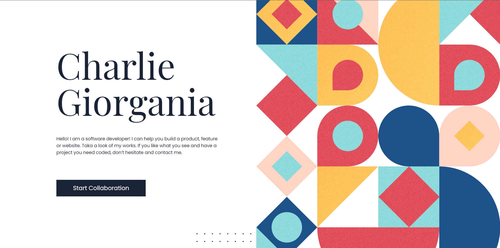
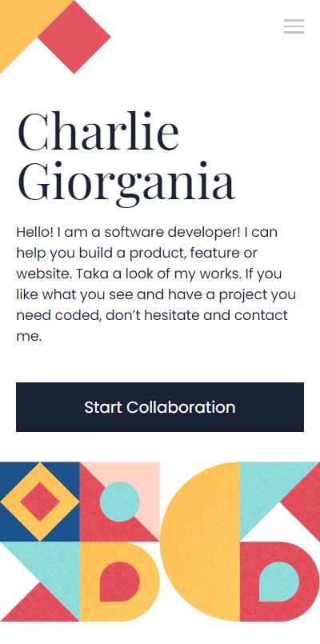

# Microverse Portfolio Webpage

> This project is meant to be an HTML & CSS exercise from the Microverse Program's Module 1.

> Desktop version

> Mobile version

The project consists in a mobile and desktop skeleton for a portfolio webpage. Feel free to try it out and explore the code as much as you like!

## Built With

- HTML5 & CSS3

## Live Demo

[Live Demo Link](https://rpire.github.io/microverse-portfolio)

## Getting Started

To get a local copy up and running follow these simple example steps.

### Get the repository into your PC.
- Clone this repository using this URL [https://rpire.github.io/microverse-portfolio.git](https://rpire.github.io/microverse-portfolio.git) or download it as a ZIP from the "Code" tab and extract the files.

### Usage
- To use it open the "index.html" file in your local copy of the repository after cloning or downloading.

## Authors

👤 **Rubén D. Pire L.**

- GitHub: [@rpire](https://github.com/rpire)
- Twitter: [@RubenPire7](https://twitter.com/RubenPire7)
- LinkedIn: [Rubén Darío Pire López](https://www.linkedin.com/in/rub%C3%A9n-dar%C3%ADo-pire-l%C3%B3pez-507111189/)

👤 **Titus Muthomi**

- GitHub: [@Kalunge](https://github.com/Kalunge)
- Twitter: [@titus_muthomi](https://twitter.com/titus_muthomi)

👤 **Daniel M. Matongo**

- GitHub: [@mmatongo](https://github.com/mmatongo)

## Show your support

Give a ⭐️ if you like this project!

## Acknowledgments

- [@microverseinc](https://github.com/microverseinc) for the readme.md and portfolio template.

## 📝 License

This project is [MIT](./MIT.md) licensed.
